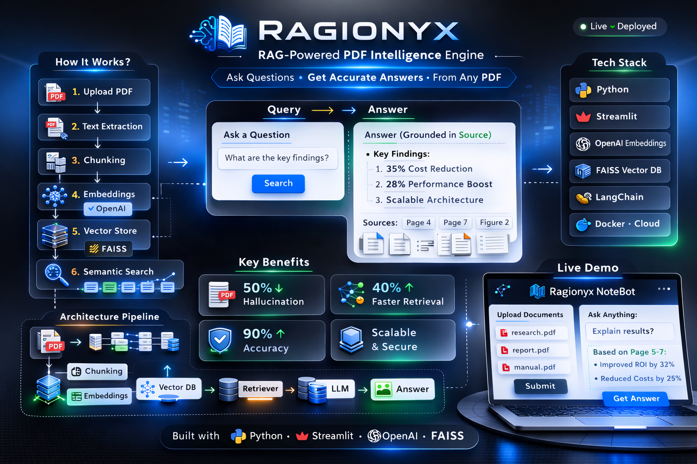

## Architecture Overview

# Ragionyx  
### Retrieval-Augmented PDF Intelligence Engine

---

## Overview

Ragionyx is a production-oriented Retrieval-Augmented Generation (RAG) system that transforms unstructured PDFs into a semantically searchable knowledge interface.

Instead of relying on model memory, the system retrieves relevant document context at query time and generates grounded responses, significantly reducing hallucination risk.

---

## How It Works

1. **PDF Ingestion** – Extract structured text from uploaded documents  
2. **Semantic Chunking** – Overlapping segmentation for contextual continuity  
3. **Embedding Generation** – Convert text into high-dimensional vectors  
4. **Vector Indexing (FAISS)** – Efficient cosine similarity search  
5. **Query Embedding** – Transform user question into vector space  
6. **Top-K Retrieval** – Fetch most relevant document chunks  
7. **Context-Grounded Generation** – LLM generates answer using retrieved evidence  

The retrieval and generation layers are intentionally decoupled for modular scalability.

---

## Key Engineering Decisions

- RAG architecture over fine-tuning for dynamic knowledge updates  
- Semantic search instead of keyword matching  
- Configurable chunk strategy to balance recall and precision  
- Context injection to constrain hallucination  
- Cloud deployment with secure environment-based secret management  

---

## Tech Stack

- Python  
- Streamlit  
- OpenAI Embeddings  
- FAISS Vector Store  
- LangChain  

---

## Live Deployment

Production-ready application available here:

👉 **[Launch Ragionyx](ragionyx-rag-powered-pdf-intelligence-engine-hzj7uxmp5zrpr3894.streamlit.app)**

---

## Scalability Path

- Multi-document corpus support  
- Distributed vector databases (Pinecone / Weaviate)  
- Embedding caching for cost optimization  
- Source citation with page-level traceability  

---

## License

This project is licensed under the MIT License.

---

## Author

**Praveen Kumar Kota**  
AI Engineer
